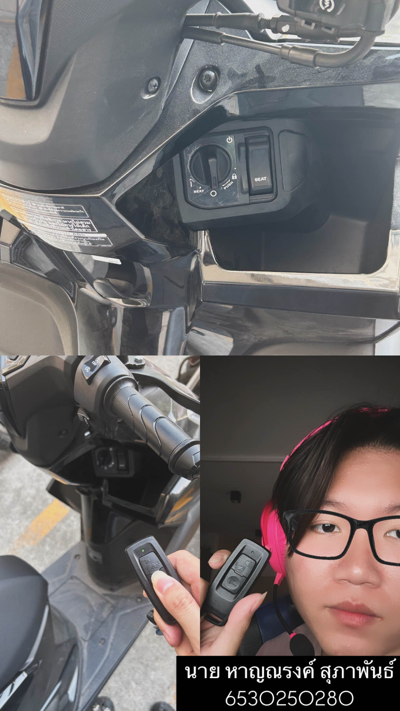

# Security Control
## ลูกบิดและกุญแจมอเตอร์ไซค์

- **Location**: My motorcycle🏍️
- **Control Function**: Preventative , Detective Controls
- **Type of Security Control** : Physical Control

## ประเภทของมาตรการควบคุมความปลอดภัย: มาตรการควบคุมทางกายภาพ (Physical Controls)
### มาตรการควบคุมทางกายภาพสามารถแบ่งออกเป็น 2 ประเภทหลัก ได้แก่
#### 1 . มาตรการป้องกัน (Preventative Controls)
- เป็นมาตรการที่ช่วยป้องกันการเข้าถึงหรือใช้งานยานพาหนะโดยไม่ได้รับอนุญาต
- ตัวอย่าง: ลูกบิดและกุญแจมอเตอร์ไซค์ทำหน้าที่ล็อกและป้องกันการสตาร์ทรถโดยบุคคลที่ไม่ได้รับอนุญาต

#### 2 . มาตรการตรวจจับ (Detective Controls)
- เป็นมาตรการที่ช่วยตรวจจับและแจ้งเตือนเมื่อมีความพยายามละเมิดความปลอดภัย
- ตัวอย่าง: หากลูกบิดหรือกุญแจมอเตอร์ไซค์ติดตั้งเซ็นเซอร์ตรวจจับการงัดแงะ (Tamper Detection) หรือมีระบบเสียงเตือนเมื่อมีการพยายามไขกุญแจผิดปกติ ก็สามารถจัดอยู่ในมาตรการตรวจจับได้

# สรุป
ลูกบิดและกุญแจมอเตอร์ไซค์เป็นส่วนหนึ่งของ มาตรการควบคุมความปลอดภัยทางกายภาพ (Physical Security Controls) โดยทำหน้าที่เป็นทั้ง มาตรการป้องกัน (Preventative Controls) ซึ่งช่วยป้องกันไม่ให้บุคคลที่ไม่ได้รับอนุญาตเข้าถึงและใช้งานยานพาหนะ และ มาตรการตรวจจับ (Detective Controls) เมื่อมีการติดตั้งระบบเซ็นเซอร์ตรวจจับการงัดแงะหรือเสียงเตือน เพื่อแจ้งเตือนเมื่อมีความพยายามละเมิดความปลอดภัย
